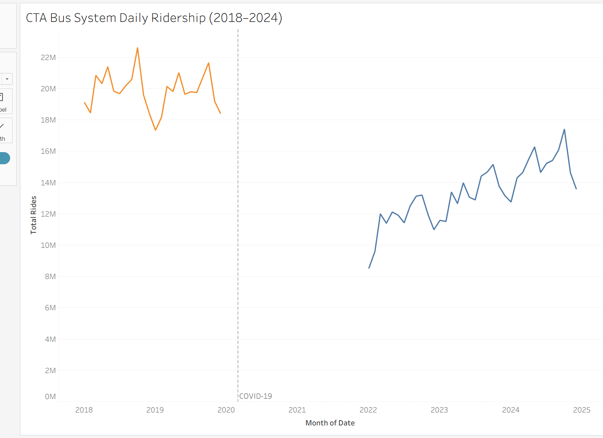
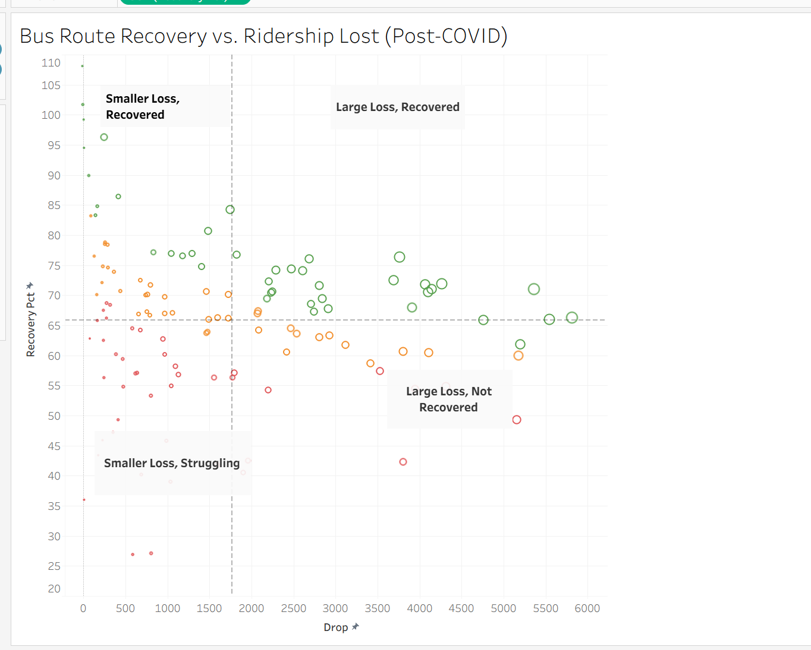
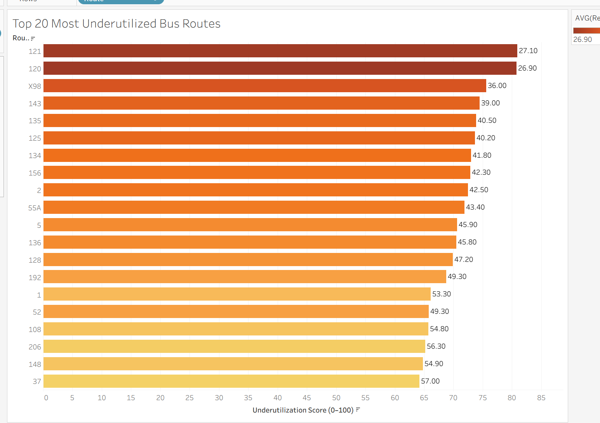
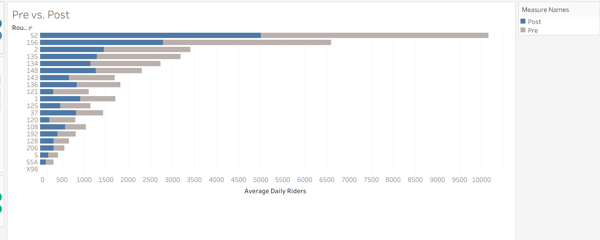
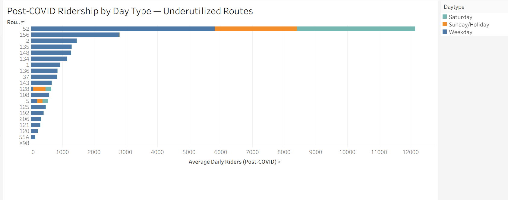

# Filling the Gaps: Identifying Underutilized CTA Bus and Rail Routes

**Prepared by:** Matt Steines
**Date:** March 2026
**Data sources:** Chicago Data Portal: CTA Daily Boarding Totals, Bus Ridership by Route, Rail Ridership by Station

---

## Executive Summary

The CTA's bus system is at 67% of its pre-COVID ridership as of 2024, and that number has barely moved in two years. The system-wide figure looks like progress. Route-level data is less encouraging. This analysis scored 128 bus routes and 143 rail stations using six years of daily ridership data from the Chicago Data Portal and found that 43 bus routes and 48 rail stations qualify as High Risk, carrying a fraction of their pre-COVID ridership with no trend toward recovery. Two Red Line stations, Berwyn and Lawrence, recorded near-zero boardings across all of 2022–2024 after averaging nearly 3,000 daily riders each before COVID. That's not a demand story. The right response isn't automatic service cuts. It starts with figuring out why these routes haven't recovered: auditing service levels on High Risk corridors, cross-referencing with equity data to find the communities most exposed, and treating the gap as a policy problem that requires a specific answer.

---

## 1. Background and context

Between 2018 and 2019, the CTA averaged 652,921 bus riders per day. By 2022 that had fallen to 437,428, a loss of roughly 215,000 daily riders. Two years later, the system is still at 67% of its pre-COVID baseline.

*Figure 1: CTA Bus System Daily Ridership (2018–2024). Orange = pre-COVID, blue = post-COVID recovery.*

The headline recovery figure hides more than it reveals. System-wide averages are dominated by the highest-volume routes, and those routes have recovered reasonably well. The problem sits elsewhere, in lower-volume routes serving specific neighborhoods, where ridership has stalled or continued falling long after the acute crisis ended.

Routes running at a fraction of their former ridership still cost money to operate. The CTA received billions in federal pandemic relief through the CARES Act and the American Rescue Plan, which kept service levels intact through the worst of the crisis. Those funds are finite and largely spent. The agency is now facing a structural budget gap with fewer riders, less fare revenue, and no emergency lifeline to fall back on. The pressure to cut underperforming routes isn't hypothetical. It's the next conversation. For residents in neighborhoods where the bus is the primary way to reach work, a clinic, or a grocery store, the difference between a route that gets cut and one that gets restructured is not abstract.

This analysis asked a simple question before that conversation happens: which CTA routes are underperforming, and how badly?

---

## 2. Data and methodology

The analysis draws on three datasets published by the Chicago Transit Authority through the Chicago Data Portal:

- CTA Daily Boarding Totals: system-wide ridership by date
- Bus Ridership by Route: daily boardings by route and day type (weekday, Saturday, Sunday/holiday)
- Rail Ridership by Station: daily boardings by station

Two time windows define the comparison: 2018–2019 as the pre-COVID baseline, and 2022–2024 as the recovery period. The years 2020 and 2021 were excluded from both windows. They represent the acute crisis period, when ridership collapsed system-wide and many routes were running on emergency schedules. Including those years would muddy both the baseline and the recovery picture. The goal is to compare normal operations before COVID against what the system looks like now, not to measure the depth of the trough.

Each bus route and rail station was scored on a 0–100 composite scale based on four factors:

- Post-COVID ridership volume (average daily boardings, 2022–2024)
- Recovery rate (what percentage of pre-COVID ridership has returned)
- Trend direction (whether ridership is still growing or has stalled through 2024)
- Day type consistency (whether the route serves riders on weekdays and weekends, or only in narrow windows)

One design choice worth flagging: the score measures proportional underperformance, not absolute ridership volume. A high-ridership route that has recovered only 50% of its former riders scores similarly to a low-ridership route in the same position. This is intentional. A large route that has lost half its riders represents a real failure of service delivery, regardless of how many riders it still has. Focusing only on low-volume routes would miss those cases entirely.

Routes were ranked by score and divided into three tiers: High Risk, Moderate, and Stable. The tiers are relative to the rest of the CTA system, not to any external benchmark. A Stable route has recovered well compared to its peers; that doesn't necessarily mean it's back to full health.

One limitation worth naming: these datasets don't include service-level data: route frequency, hours of operation, or schedule changes. A route running every 30 minutes can't realistically attract the ridership of one running every 10 minutes, and this analysis can't separate demand-side decline from supply-side cuts. Where findings suggest a route has collapsed, that warrants direct investigation rather than a simple conclusion about demand.

---

## 3. Findings

### 3a. The system-wide recovery gap

Of the 128 bus routes with complete data in this analysis, roughly one-third sit in each tier:

| Tier | Bus routes | Rail stations |
|---|---|---|
| High Risk | 43 | 48 |
| Moderate | 42 | 47 |
| Stable | 43 | 48 |
| **Total** | **128** | **143** |

The Stable tier is reassuring but geographically concentrated. High-ridership routes along major corridors (Western, Pulaski, Cottage Grove) have recovered to roughly 70–80% of pre-COVID levels and are trending upward. They carry a disproportionate share of total system ridership, which is why the top-line number looks better than the route-level picture.

The High Risk tier is the concern. 43 bus routes and 48 rail stations are carrying significantly less ridership than before COVID with no clear sign of improvement. That is one in three routes in this dataset.

*Figure 2: Each dot is one route. Position = drop magnitude vs. recovery rate. Color = tier (green = Stable, orange = Moderate, red = High Risk). Size = pre-COVID ridership volume.*

### 3b. Underutilized routes by tier

**High Risk bus routes**

The worst-scoring routes aren't low-volume routes that were always marginal. Several carried well over 1,000 daily riders before COVID.

Route 121 averaged 1,104 daily boardings in 2018–2019. In 2022–2024, that number is 300, a 73% decline with a recovery rate of 27.1%. Route 120 is nearly identical: from 801 daily riders to 215, recovering at 26.9%. Route 135 went from 3,186 daily riders to 1,289, recovering at 40.5%.

These aren't routes where demand evaporated because neighborhoods changed. The drop is too sharp and too consistent. Something happened to ridership on these routes during COVID and it hasn't come back.

One route worth calling out specifically is Route 52. With roughly 5,000 daily riders in the post-COVID period, it doesn't look like a struggling route at first glance. But before COVID it was carrying closer to 10,000. That's a 49.3% recovery rate, less than half its former ridership. Because the scoring model measures proportional loss rather than raw volume, Route 52 ranks as High Risk. A route that once served 10,000 people and now serves 5,000 isn't fine. It has a hole in it.

*Figure 3: Top 20 bus routes ranked by composite underutilization score (0–100). Darker red = higher risk.*

*Figure 4: Blue = post-COVID average daily riders. Gray = pre-COVID baseline. The gap between them is what was lost.*

**High Risk rail stations**

Rail tells a more extreme version of the same story. Berwyn station on the Red Line averaged 2,845 daily boardings in 2018–2019. In the 2022–2024 period, it recorded zero. Lawrence station, also on the Red Line, averaged 2,762 daily boardings before COVID and similarly recorded near-zero in the recovery period.

A drop to zero at two stations on a major north-south line isn't a demand story. Stations don't go from nearly 3,000 daily riders to nothing because people decided to drive. This almost certainly reflects a service disruption (renovation, closure, or a schedule gap) that the ridership data can't explain on its own. The data can tell us something stopped working at these stations. It can't tell us what.

**Moderate-tier routes**

The middle tier is less dramatic but harder to read. Recovery rates range from roughly 40% to 65% of pre-COVID levels. Some routes here are trending upward. Others have been flat since 2022. Without service-level data, it's hard to say whether these routes are on a path back toward their old ridership or whether 50–60% is the new normal.

*Figure 5: Stacked bars show how ridership breaks down by day type. Routes like 156 show stronger weekend demand relative to weekday — a restructuring signal.*

Route 156 is the clearest restructuring candidate in the dataset. Weekday ridership has barely recovered, but Saturday and Sunday boardings are holding relatively steady. The riders are still there; they're just not commuting. Running a standard weekday-heavy schedule for a route that has shifted toward weekend use is a mismatch between service design and actual demand. This route probably doesn't need to be cut. It needs to be redesigned.

Route 52 tells a different story. Unlike Route 156, ridership on Route 52 has collapsed across every day type: weekdays, Saturdays, and Sundays alike. There's no scheduling explanation for that. The riders haven't shifted to weekends; they've left. Combined with its proportional ranking as High Risk, Route 52 is one of the routes that most warrants direct investigation before any investment decision is made.

**Stable routes**

The best-performing routes are concentrated in the highest-density corridors and aren't a cause for concern. What they are is a useful reference point: the CTA's strongest routes sit at 70–80% of pre-COVID levels. Its weakest are at 25–40%. Two years into the recovery period, that gap hasn't moved.

---

## 4. Recommendations

### Recommendation 1: Audit service levels on all 43 High Risk bus routes before cutting any of them

This analysis identifies 43 High Risk bus routes based on ridership outcomes, but it can't determine whether low boardings reflect low demand or inadequate service. A route running every 30 minutes with unreliable on-time performance won't attract riders, and the data here looks identical to a route where neighborhood demand has genuinely declined. Cutting a route that's underperforming because of poor service quality makes the problem worse and damages trust with the riders who still depend on it.

CTA operations should conduct service-level audits for all 43 High Risk routes in the next budget cycle, documenting current frequency, span of service, and on-time performance. Outreach to residents in affected neighborhoods should be part of that process; riders know things that schedules don't capture. The audit is what distinguishes a route that needs investment from one that needs restructuring.

Knowing which situation applies to each route is the precondition for any spending decision.

---

### Recommendation 2: Prioritize recovery investment on High Risk routes serving transit-dependent neighborhoods

A route that dropped from 3,000 daily riders to 800 in a neighborhood with low car ownership is a different problem than the same drop in a corridor where most residents drive. The underutilization score treats both the same.

The 43 High Risk bus routes should be cross-referenced against census data on vehicle ownership, median income, and commute mode. Routes serving high transit-dependency areas with low recovery should be first in line for targeted investment: increased frequency, extended service hours, or schedule restructuring. If the routes that haven't recovered are concentrated in specific communities, which an equity overlay would show quickly, that's not a data pattern. That's a decision someone made, or failed to make, about who gets reliable transit service.

---

### Recommendation 3: Investigate the Red Line stations showing near-zero post-COVID ridership

Berwyn and Lawrence stations recorded near-zero boardings across all of 2022–2024 after carrying roughly 5,600 combined daily riders before COVID. No organic demand shift produces a result like that. Something structural happened.

Start with the service logs: were Berwyn and Lawrence actually operating normally during 2022–2024, or were they closed or running reduced service? If the disruption has since ended, these stations need to be treated as reactivation projects. Former riders don't automatically know when service resumes. Reaching them requires direct outreach in Edgewater and Uptown, not just a schedule update on the CTA website.

Set a measurable target, something like returning to 60% of pre-COVID boardings within 18 months of full service restoration, and track monthly boarding data at both stations. If the cause is ongoing and these stations still aren't operating normally, residents in those neighborhoods deserve a public explanation. Two stations losing nearly 6,000 combined daily riders is not a footnote.

---

## 5. Conclusion

Chicago's transit system has recovered from COVID, partially. The system-wide numbers suggest steady progress. Route-level data tells a different story: one in three bus routes and one in three rail stations in this analysis are classified High Risk, carrying a fraction of their pre-COVID ridership with no clear trend toward improvement.

Automatic cuts would be the wrong response, and so would treating every underperforming route the same way. A route struggling because of poor service quality is a different problem than one in a neighborhood where travel patterns have genuinely shifted. Berwyn and Lawrence are something else entirely, an anomaly the data can flag but can't explain without someone actually digging into it.

The CTA has the ridership data to see where the gaps are. What's been missing is a framework for acting on them at the route level rather than the system level. This analysis is meant to be that starting point.

---

*Data: Chicago Data Portal. Analysis period: 2018–2019 (pre-COVID baseline) and 2022–2024 (recovery period). Composite scoring model weights ridership volume, COVID recovery rate, trend direction, and day type consistency on a 0–100 scale. Full methodology available upon request.*
